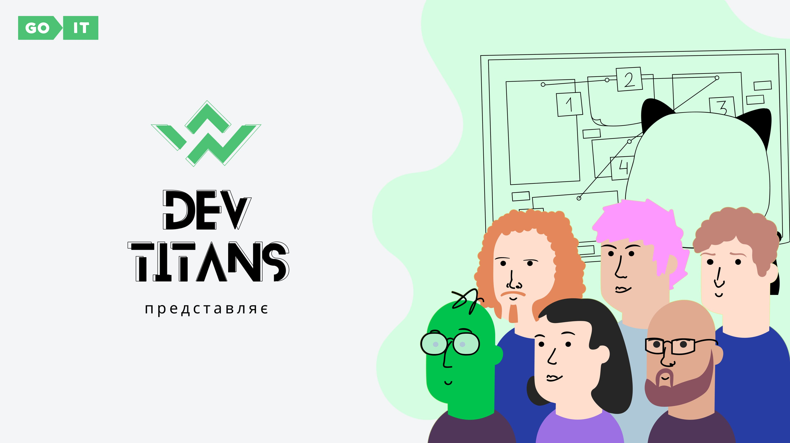
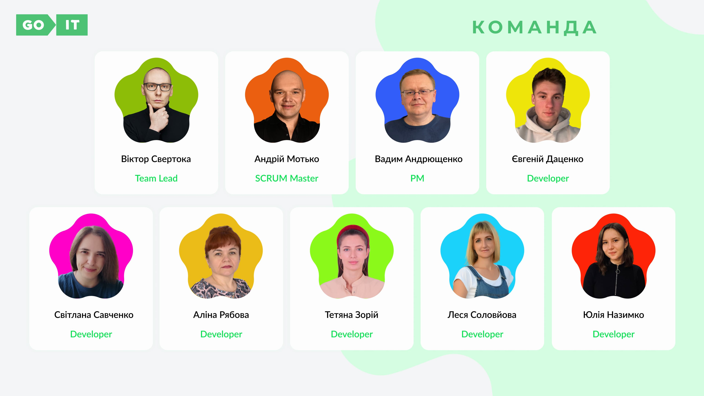
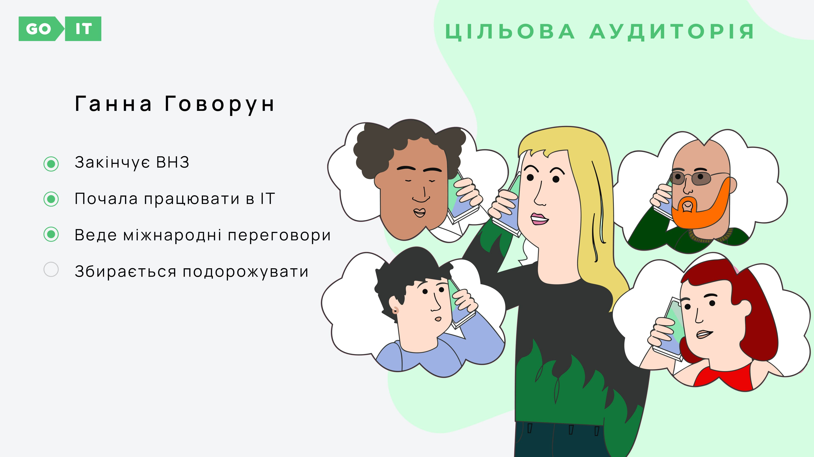
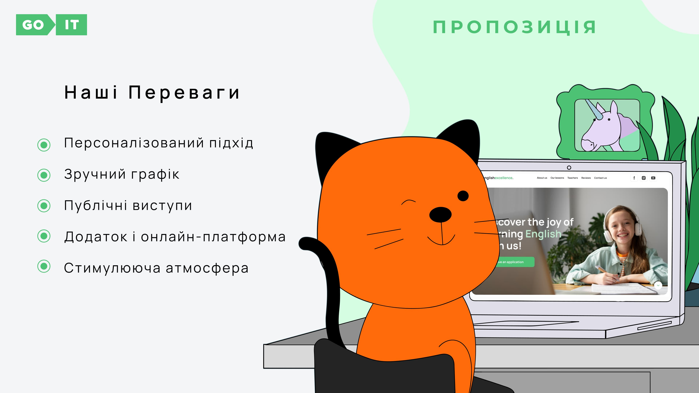
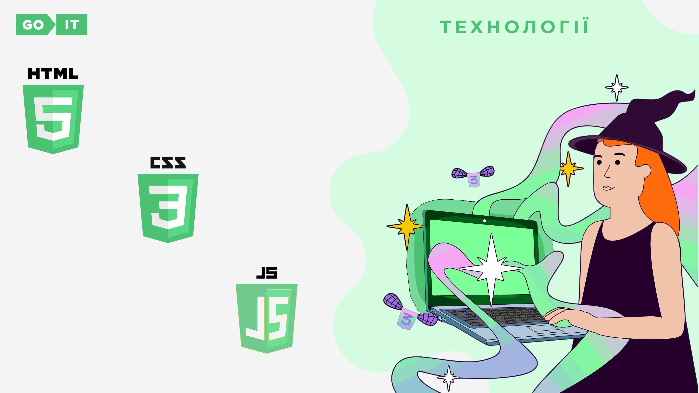
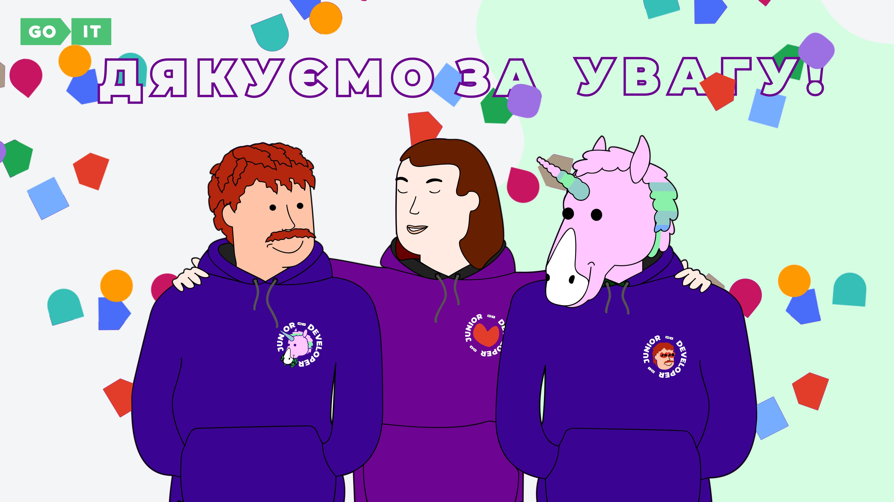

# Development team :

- 
  Viktor Svertoka **Team Lead** development of the section **Reviews**

- 
  Andrew Motko **Scrum Master** development of the section **Header**

- 
  Lesia Soloviova **Front End Developer** development of the section **Leave an
  application**

- 
  Alina Riabova **Front End Developer** development of the section **Hero**

- 
  Svitlana Savchenko **Front End Developer** development of the section
  **Footer**

- 
  Tetiana Zorii **Front End Developer** development of the section **Proposal to
  leave an application**

- 
  Vadym Andriushchenko **Front End Developer** development of the section **Our
  teachers**

- 
  Yuliia Nazymko **Front End Developer** development of the section **About us**

- 
  Yevhenii Datsenko **Front End Developer** development of the section **Our
  lessons**

# Presentation

# Examples of writing commits on a project

## We use the following types of commits:

- Feat(HTML) Added new functionality

- Fix(JS) Error correction

- Perf(JPEG) Changes to improve performance

- Refactor(PNG) Code edits without fixing bugs or adding new features

- Revert(JS) Rollback to previous commits

- Style(SCSS) Code style edits

- Docs(README) Documentation update

Choose from the list the description of the commit that fits your task, in
brackets we write the file in which we worked, and in the body of the commit we
write what we did (changed) etc.

- `Look at Figma layout`
  [**Layout Figma**](https://www.figma.com/file/MrdZUmIfeT1bKd8u5GWLRt/English-Excellence-2.0?type=design&node-id=0-1&mode=design&t=4jJkOR8gcvoKgG1k-0)

npm run dev
